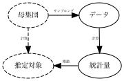
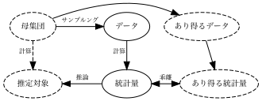

```{r}
library(tidyverse)

data <- read_csv("Public/example.csv")
```

# データ分析

## ここまでのデータ活用

- **事例ごとの個別予測** を行う予測モデルを推定する

- LASSOを活用すれば、複雑なモデルも推定できる

  - [**板橋区**、55平米、駅から5分、３部屋、築20年]の物件の予測価格は5000万円
  
  - [**練馬区**、55平米、駅から5分、３部屋、築20年]の物件の予測価格は5500万円

- 注意点: 人間行動や社会的な帰結を予測することは難しい

  - AIサギに注意 [@narayanan2024ai]

## 他のデータ活用

- 事例**全体**の"重要な特徴"を要約し、報告する

  - [スカイラークの中期経営計画](https://corp.skylark.co.jp/ir/strategy/growth/)

  - [経済財政白書](https://www5.cao.go.jp/keizai3/whitepaper.html)
  
- 多くの人に伝えやすいので、利害関係者が多い集団的意思決定(政策、大企業の戦略決定等)向いている

  - 経済学における実証分析の中核的な目標

## ロールプレイ: 不動産市場分析チーム

- 会社全体の意思決定を支援する情報(ファクト)として、地区ごとの平均価格を示す

- 例えば、 **データ上の** 練馬区との平均的な取引価格の差は

```{r}
#| echo: true

model <- lm(Price ~ fct_relevel(District,"練馬区"), data)

model
```

## 図示

```{r, dev='ragg_png'}
data |> 
  mutate(
    District = fct_relevel(District,"練馬区")
  ) |> 
  estimatr::lm_robust(
    Price ~ District,
    data = _
    ) |> 
  generics::tidy() |> 
  filter(
    term != "(Intercept)"
  ) |> 
  mutate(
    term = term |> 
      str_sub(9,-2)
  ) |> 
  ggplot(
    aes(
      y = reorder(term,estimate),
      x = estimate
    )
  ) +
  geom_point() +
  theme_bw() +
  ylab("") +
  geom_vline(
    xintercept = 0,
    color = "grey"
  ) +
  xlim(-10,75)

```


## 本スライドのTakeaway

- 全ての物件(母集団)ではなく、調査された物件についての差に過ぎない

  - 母集団における平均差はどのようなものか?

- 信頼区間を用いて推論

## 信頼区間

```{r, dev='ragg_png'}

q <- qnorm(1 - (0.05/(2*22)))

data |> 
  mutate(
    District = fct_relevel(District,"練馬区")
  ) |> 
  estimatr::lm_robust(
    Price ~ District,
    data = _
    ) |> 
  generics::tidy() |> 
  filter(
    term != "(Intercept)"
  ) |> 
  mutate(
    term = term |> 
      str_sub(9,-2)
  ) |> 
  ggplot(
    aes(
      y = reorder(term,estimate),
      x = estimate,
      xmin = conf.low,
      xmax = conf.high
    )
  ) +
  geom_pointrange(
    aes(
      xmin = estimate - q*std.error,
      xmax = estimate + q*std.error,
      color = "補正ずみ"
    )
  ) +
  geom_pointrange(
    aes(
      color = "補正なし"
    ),
    linewidth = 1.5
  ) +
  theme_bw() +
  ylab("") +
  geom_vline(
    xintercept = 0,
    color = "grey"
  ) +
  xlim(-10,75)

```

## 推奨するコード

```{r,dev = 'ragg_png'}
#| echo: true

model <-estimatr::lm_robust(Price ~ fct_relevel(District,"練馬区"), data)

dotwhisker::dwplot(model)
```


# コイントスの例

## コイントス

- よく使われる例を使って、データ分析のコツを掴む

  - 研究目標: 「コイントスの結果が公平かどうかを検証しよう」

- コイントスは"公平なくじ"として、幅広く利用されている

  - 先行/後攻、昼食のお店
  
  - 実際にも重要な研究目標?


## @bartovs2025fair

- 研究目標 $=$ 「投げた時と同じ面が出やすい」仮説を検証

- 350,757回のコイントスにより、事例をサンプリング

  - 実際のサンプリング風景の [Youtube](https://www.youtube.com/watch?v=3xNg51mv-fk)

  - 母集団 $=$ 無限回のコイントスを行った結果

## @bartovs2025fair

- データ上で、同じ面になった回数は、178,079回

  - $178079/350757\approx 0.507$
  
    - $=$ 推定値

  - 同じ面が出やすい傾向

- 批判: 偶然であり、もう一回実験をやれば結果が変わるのでは?

## イメージ



## 再現可能性

- コツは、「得られた可能性があるが、実際には得られていないデータ」を想像すること

- 二人が、5回コイントスを行いデータ収集

  - 全員のデータが異なるので、結果も異なる
  
    - 結果が再現できないので、誰の結果も信頼できない

- あくまでフィクションであることに注意

  - 本当に各人がデータを収集したのであれば、データを共有し、結合すべき
  

## 例



## あり得た結果

- 自身の研究目標は、基本的に「自分以外は行わない」ケースが多い
  
  - **仮想的な** 別のデータを常に意識する必要がある
  
    - 頻度論と呼ばれる枠組み

## 統計的推論

- 同じ研究目標に対して、さまざまなデータを得る可能性があるので、確実に正しい結論を得ることは、**あきらめる**

- 概ね正しい結論を目指す

  - 主張 「母集団において同じ面になる割合は、**概ね(95%の確率で)** 信頼区間 $[0.506,0.509]$ の間」は真

  - 事例がランダムサンプリングされており、十分な事例数 (150事例以上)が存在することが前提


## 信頼区間

- データから計算される区間

  - 同じ母集団、推定対象であったとしても、データが異なれば、異なる区間が計算される

    - ただし多くのデータ (初期値では、潜在的に生成されうるデータの95 $\%$) について、推定対象を含む区間が算出される
    
    - 「自身が計算した信頼区間は、概ね、推定対象を含む」

- 平均値やOLSについては、サンプル分割は**不要**

## データ

```{r, dev='ragg_png'}
example <- tibble(
  ID = rep(seq(1:30),200),
  Y = rnorm(30*200,10,10)
  )

est <- rep(0,30)
sd <- rep(0,30)

for (i in 1:30){
  model <- estimatr::lm_robust(
    Y ~ 1,
    example |> 
      filter(ID == i)
  )
  est[i] <- model$coefficients
  sd[i] <- model$std.error
}

tibble(
  ID = seq(1,30),
  est,
  sd
) |> 
  ggplot(
    aes(
      y = ID,
      x = est,
      xmin = est - 1.96*sd,
      xmax = est + 1.96*sd
    )
  ) +
    geom_pointrange() +
    geom_vline(xintercept = 10) +
    ylab("ありえたデータ名") +
    xlab("推定値") +
  theme_bw()
```


## 非実用的な推論の例

- 前提

  - 無限回のコイントス(無限大の事例)から得られた同じ面になる割合は、$0.508$
- 結論 $=$ 母集団において、同じ面になる割合は、$0.508$
    
  - 一致性と呼ばれる性質

- 問題点: 無限大の事例を持つデータは、存在しない

## 非実用的な推論の例

- 前提 

  - 100 $\%$ 当たる予測モデルが使える

  - 同じ面が出る予測確率は、$0.508$

- 結論 $=$ 母集団において、同じ面になる割合は、$0.508$
  
- 問題点: 確実に当たるモデルは、(社会/市場分析では)想定しずらい

## Reference